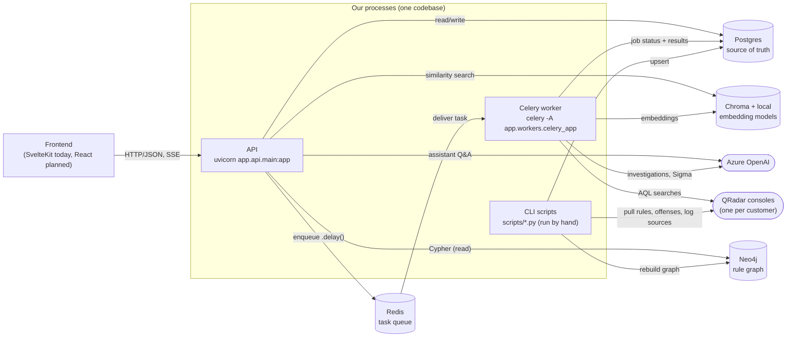
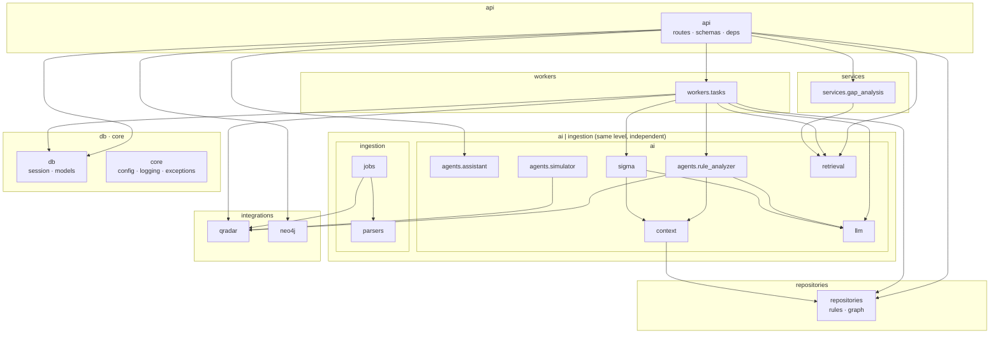
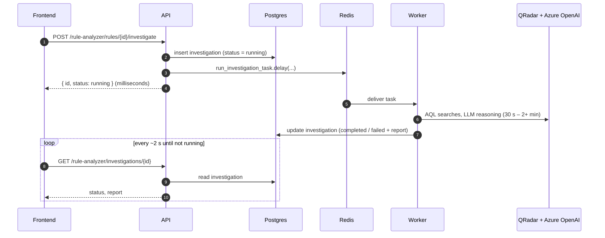

# Backend high-level design

Rule Intelligent Sol analyzes IBM QRadar detection rules for multiple customers. It pulls each customer's rules, building blocks, MITRE mappings and log sources from QRadar, parses them into Postgres, builds a dependency graph in Neo4j, and adds AI features on top: natural-language questions about the rules, automated rule investigations, coverage-gap analysis, Sigma rule generation and cross-customer similarity search.

This document describes the backend **as it is in the code today**. The import edges and external connections below were measured from the source (import graph via `grimp`), not drawn from intent. The target design and its reasoning are in [ADR 0001](../adr/0001-modular-monolith-structure.md); the API contract is in [`docs/api/`](../api/README.md).

## 1. Runtime: processes and connections

Three kinds of process run from the same codebase. They never call each other directly: the API hands work to the worker through Redis, and the worker reports back by writing to Postgres.

### Who connects to what

| | Redis | Postgres | Neo4j | Chroma + models | Azure OpenAI | QRadar |
|---|---|---|---|---|---|---|
| **Frontend** | – | – | – | – | – | – |
| **API** | enqueue | ✔ | ✔ | ✔ similarity search | ✔ assistant only | **–** |
| **Worker** | consume | ✔ | – (rule-chain context reads Postgres) | ✔ embedding batches | ✔ | ✔ AQL in investigations |
| **CLI scripts** | – | ✔ | ✔ graph build | – | ✔ simulator only | ✔ ingestion, simulator |

The frontend only ever talks to the API. The API never calls QRadar; every QRadar call happens in the worker or a CLI script.

## 2. Code: layers and import direction

An arrow means "imports". Every arrow points down; `import-linter` enforces this in CI (contracts in `pyproject.toml`). Edges to `app.core` are omitted because every layer may use it.

| Layer | Contains | Talks to |
|---|---|---|
| `api` | FastAPI app, `v1/routes`, `v1/schemas`, dependencies | everything below |
| `workers` | Celery app; tasks for investigations, Sigma, embeddings | ai, repositories, integrations, db |
| `services` | gap analysis (MITRE, log sources) | ai.retrieval |
| `ai` | LLM provider, three agents, Sigma generation, retrieval, rule-chain context | repositories, integrations |
| `ingestion` | QRadar → Postgres jobs, Postgres → Neo4j graph build, XML/condition/response parsers | integrations |
| `repositories` | read queries for rules (Postgres) and the graph (Neo4j) | db |
| `integrations` | QRadar HTTP client + per-customer factory, Neo4j driver | core |
| `db`, `core` | SQLAlchemy base/session/models; config, logging, exceptions | – |

## 3. What is deliberately not connected

These pairs have no imports between them. The first two groups are enforced in CI; the rest are true today and should stay true.

| Not connected | Why it matters | Enforced |
|---|---|---|
| Any lower layer → a higher layer (e.g. `ai` → `api`, `db` → `services`) | Business logic never depends on HTTP; models never depend on features | ✔ layers contract |
| `agents.assistant` ↔ `agents.rule_analyzer` ↔ `agents.simulator` | Three separate products; shared code goes in `ai.llm` / `ai.context` | ✔ independence contract |
| `ai` ↔ `ingestion` | Ingestion is deterministic and must keep working without any LLM | ✔ same layer, `\|` |
| `api` → `ingestion` | No HTTP endpoint triggers a QRadar sync; ingestion runs from CLI scripts | observed |
| `workers` → `api` | Workers report results through Postgres, never by calling the API | ✔ layers contract |
| `api` → `integrations.qradar` | Request handlers never wait on a QRadar console | observed |

## 4. Key flows

### Asynchronous investigation (Rule Analyzer)

Sigma generation and embedding batches follow the same pattern; their progress is also available as a server-sent event stream (`GET …/stream`).

### Synchronous reads

`GET /rules`, `/graph/*`, `/customers`, the gap analyses and similarity search answer within the request: route → repository / service → Postgres, Neo4j or Chroma → response schema.

### Ingestion (by hand today)

`scripts/ingest.py` → `scripts/sync_bb_relationships.py` → `scripts/build_graph.py`, per customer: pull from QRadar, upsert into Postgres, parse rule XML into conditions/building-block links/responses, rebuild that customer's slice of the Neo4j graph.

## 5. API contract

22 endpoints under six tags (`rules`, `graph`, `agent`, `rule-analyzer`, `recommendations`, `customers`) plus `/health`. The contract is generated from the code into [`docs/api/openapi.json`](../api/openapi.json) with a readable [reference](../api/README.md); CI fails if a route or schema changes without regenerating it.

## 6. Known gaps (next steps)

| Gap | Where | Planned fix |
|---|---|---|
| No authentication or tenant authorization; tenant is a URL/query parameter | `api` | OIDC/JWT + user↔customer membership |
| `agents.assistant` builds its own Azure client instead of using `ai.llm` | `ai.agents.assistant.nodes` | Route through the LLM provider interface |
| `core` imports FastAPI (`exceptions.py`) | `core` | Keep HTTP mapping in `api/exception_handlers.py` only |
| Raw SQL in routes, tasks and agents (35 modules) | several | Repositories, table by table, before the DB redesign |
| ORM models and the database differ (`alembic check`: ~60 differences; some tables have no model) | `db.models` | Database redesign |
| One worker consumes every task; ingestion is manual | `workers` | `llm` and `ingestion` queues, Celery beat schedule |
| Auto-generated operation IDs (e.g. `get_health_metrics_rules_metrics_get`); SSE endpoints untyped | API contract | Explicit operation IDs and stream event schemas |
| URLs are not versioned although code lives in `api/v1` | API contract | `/api/v1` prefix together with the new frontend |
